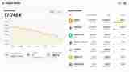

# Crypto Wallet

An editable cryptocurrency portfolio with value, price and holdings per coin. The current total can be calculated from coin values.

## Requirements

- Dwains Dashboard Next
- button-card, layout-card and vertical-stack-in-card
- three matching numeric sensors per coin. A total-value sensor is only needed for portfolio history graphs.

## Preview

