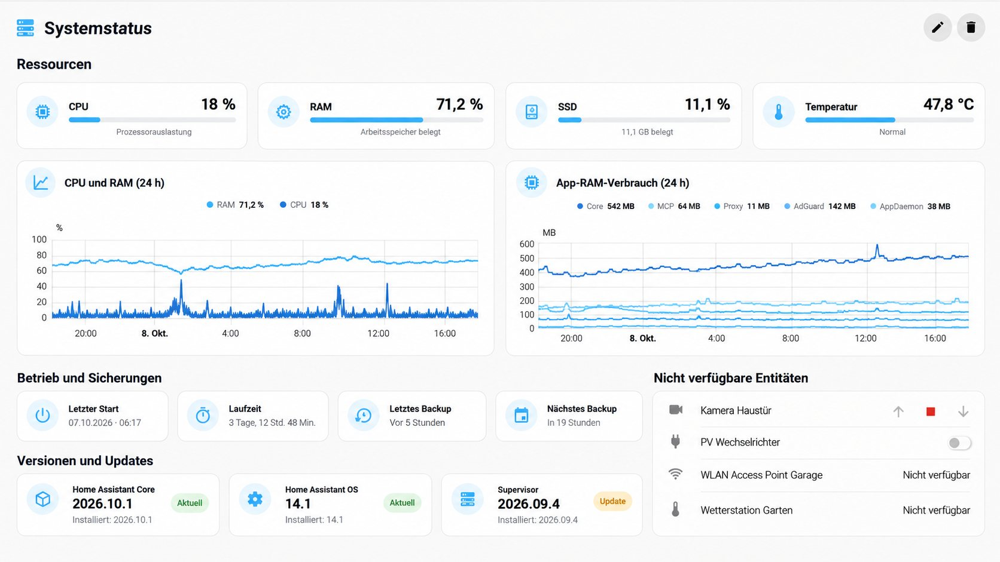

# System Monitor

Home Assistant system information, resource graphs, backups and update status.

## Requirements

- Dwains Dashboard Next
- button-card, layout-card, auto-entities and vertical-stack-in-card
- matching system monitor, backup and update entities.

## Preview

